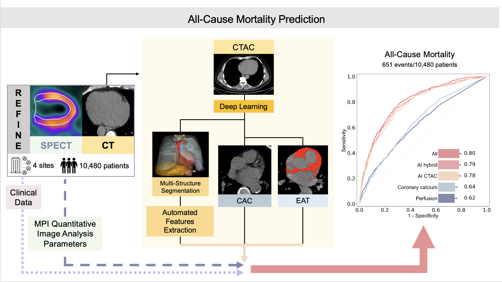

# Holistic AI analysis of hybrid cardiac perfusion images for mortality prediction

This repository contains the code for the the paper "Holistic AI analysis of hybrid cardiac perfusion images for mortality prediction" accepted in npj digital medicine (2025-02).

Backgroud: Low-dose computed tomography attenuation correction (CTAC) scans are used in hybrid myocardial perfusion imaging (MPI) for attenuation correction and coronary calcium scoring, and contain additional anatomic and pathologic information not utilized in clinical assessment.

Objectives: The aim is to uncover the full potential of these scans utilizing a holistic artificial intelligence (AI)-driven image framework for image assessment. 

Key results:

    1. In this retrospective study of Of 10,480 patients, our proposed AI model, 0.80 (95% confidence interval [0.74-0.87]), markedly enhances mortality prediction over models that utilize only myocardial perfusion information, 0.62 ([0.55-0.70], p<0.001).
    2. We developed an explainable method to highlight high-risk structures that may need further investigation to uncover potentially significant conditions, beyond coronary artery disease.

Conclusion: CTAC significantly enhances AI risk stratification with MPI SPECT/CT beyond its primary role - attenuation correction. A comprehensive multimodality approach can significantly improve mortality prediction compared to MPI information alone in patients undergoing cardiac SPECT/CT.

Files in this repository:

 - `xgboost.py` -- code used to develop the AI model described in the study;

The code used to perform the analyzes described in the article depends also on the following open source repositories:

The TotalSegmentator code is publicly available (https://github.com/wasserth/TotalSegmentator), cLSTM code is publicly available under a Creative Commons BY-NC license at https://doi.org/10.5281/zenodo.10632288, PyRadiomics code is available at https://pyradiomics.readthedocs.io/en/latest/, and the XGBoost Python implementation is available at https://xgboost.readthedocs.io/en/stable/python/. 

---

Graphical abstract of the article:

